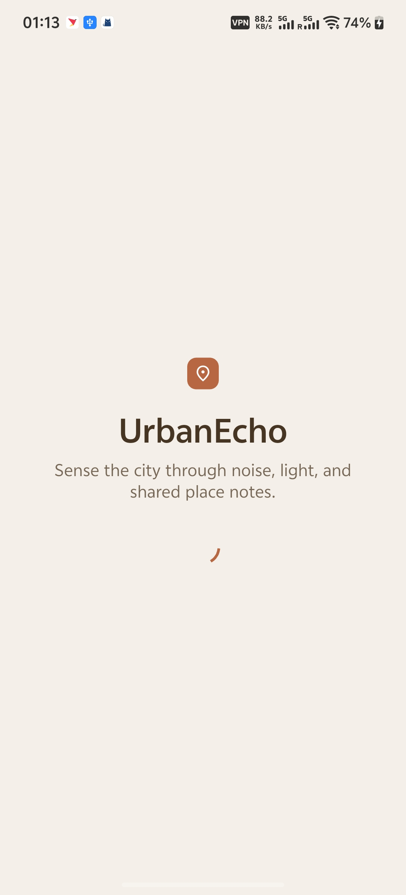
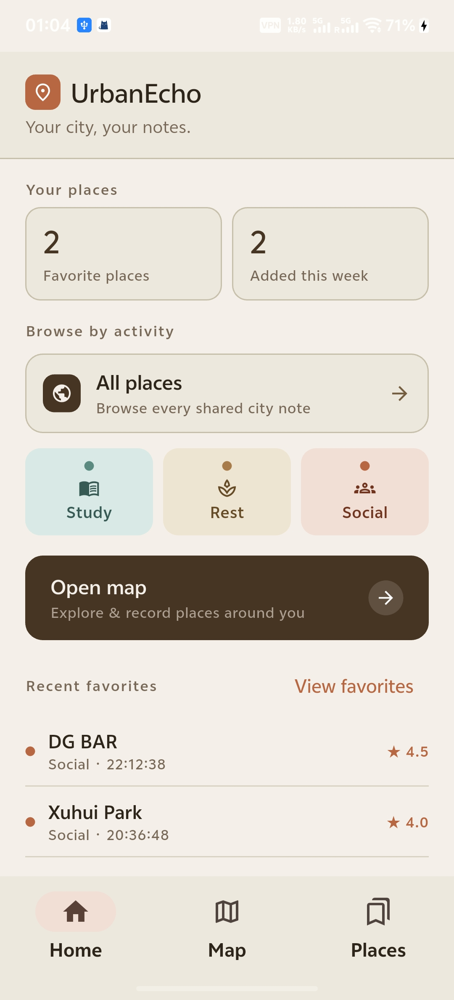
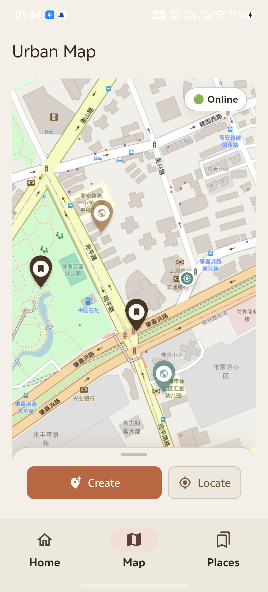
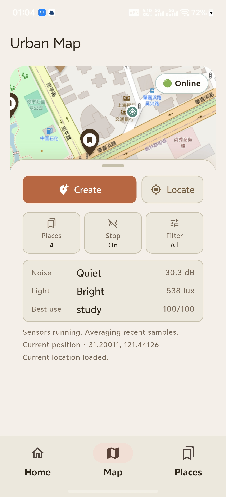
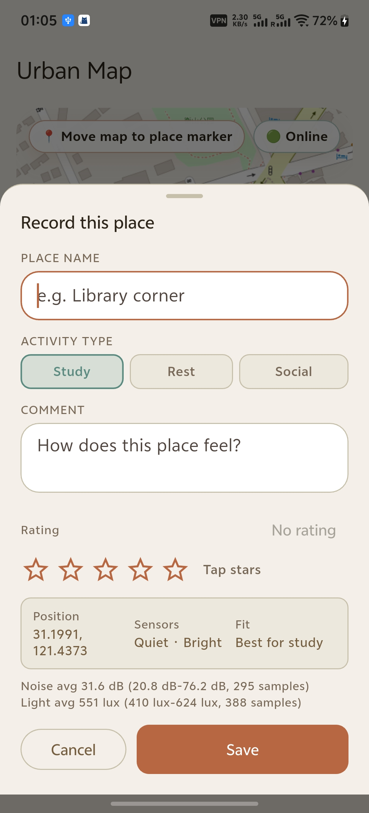
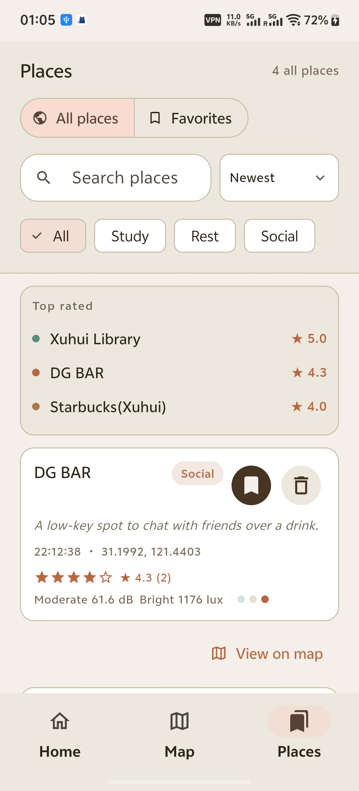
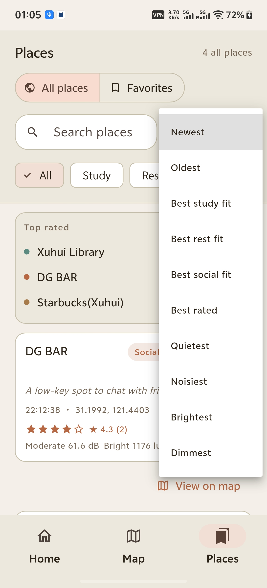
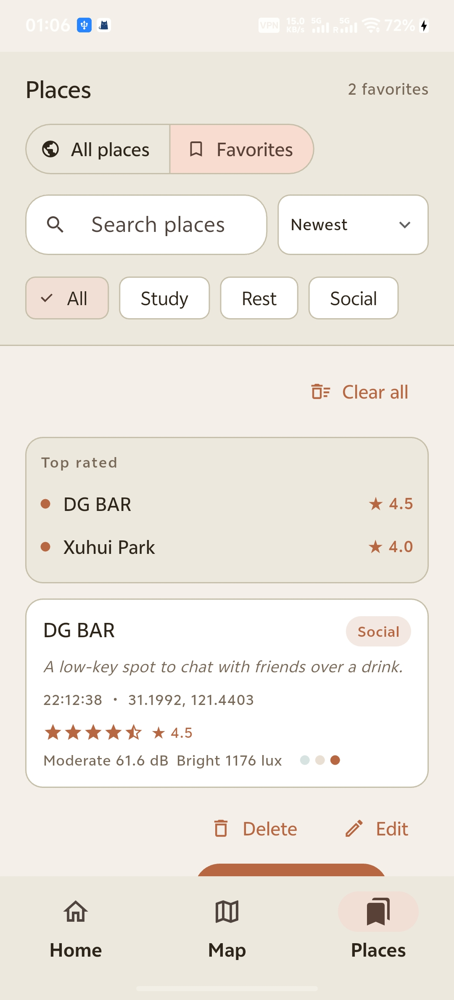
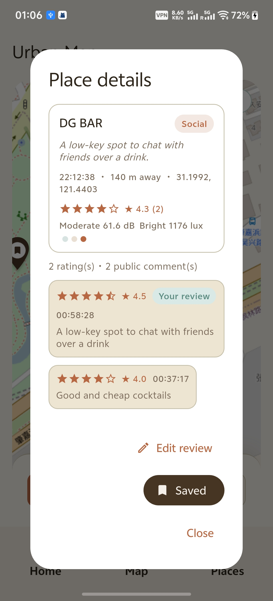

# UrbanEcho

UrbanEcho is an Android-first Flutter app for recording and exploring city places through environmental sensing, map-based place memory, and shared public feedback. It combines phone sensors, location, OpenStreetMap, and MQTT so users can compare how different places feel for studying, resting, or socialising.

## Project Idea

Students and city users often choose places based on vague memory: whether a space felt quiet, bright, busy, or comfortable. UrbanEcho turns those impressions into small place records by combining:

- Noise readings from the phone microphone.
- Light readings from the phone light sensor.
- GPS location shown on an interactive map.
- User notes, activity type, star ratings, and shared comments.
- MQTT-based online sharing so places can appear for other users.

The app is not intended to be a scientific pollution monitor. Its goal is to make urban environmental experience easier to record, compare, and discuss.

## Current Features

- Warm notebook-style interface with Home, Map, and Places views.
- Opening screen explaining the purpose of the app.
- Live sensor scanning for noise and light.
- Current location detection and map centering.
- Create places by moving the map under a fixed centre marker.
- Create shared places with a name, activity type, notes, 0-5 star rating, and sensor context.
- Places view with All Places, Favorites, search, filtering, sorting, and top-rated places.
- MQTT-based shared places, average ratings, and public comments.
- Local favorites for places the user wants to bookmark.
- Temporary moderation delete action for shared places during prototype testing.
- OpenStreetMap map tiles through `flutter_map`.

## App Walkthrough

### Opening and Home

UrbanEcho starts with a short opening page that explains the app purpose before moving into the main interface. The Home page gives quick access to All Places, activity-based browsing, the map, and recent favorites.




### Map and Sensor Capture

The Map page shows the user's current location, shared places, and favorited places. The bottom panel contains the main actions: locating the user, starting sensor capture, creating a place, and opening the Places view.




### Creating a Place

To create a place, the user first starts Sensors so the app has noise and light data. The place is positioned by moving the map under the fixed centre marker, then the create sheet records the name, activity type, rating, note, coordinates, and sensor context.



### All Places and Sorting

All Places shows shared MQTT places from all users. The list can be filtered by activity type and sorted by recency, rating, study fit, rest fit, social fit, noise, or light.




### Favorites

Favorites are local bookmarks for places the user wants to keep. They make it easier to return to useful shared places without changing the public All Places list.



### Place Details and Public Feedback

Place Details combines location, environmental fit, sensor readings, average star rating, and public comments. Each user can add one rating/comment for a shared place and later edit their own review; the displayed score is calculated from shared feedback.



## Landing Page

The project includes a static landing page published through GitHub Pages:

```text
https://blackinnnk.github.io/casa0015-UrbanEcho/
```

The source file is:

```text
docs/index.html
```

It introduces the app concept, shows the main Android screens, and summarises how UrbanEcho uses sensing, MQTT sharing, favorites, and public feedback. If GitHub Pages is enabled for the repository, the `docs/` folder can be used as the published site source.

## How It Works

1. The user opens the app and reviews the opening screen.
2. On the Map page, the user starts Sensors so the app can read GPS location, noise level, and light level.
3. The user creates a place by moving the map so the fixed centre marker points to the target location.
4. The create sheet stores the place name, activity type, note, rating, coordinates, and sensor readings.
5. If MQTT is configured, the place is uploaded to All Places and synced with other users.
6. Other users can open Place Details, add or edit their own rating/comment, and see the average score.
7. Users can bookmark useful shared places into Favorites for quick local access.

## User Testing Scenario

The main testing scenario was based on a student using UrbanEcho on a physical Android phone to compare nearby study, rest, and social spaces.

### Test Goal

Check whether a user can create shared places with real sensor context, browse them later, favorite useful places, and understand public ratings/comments from other users.

### Test Tasks

1. Open the app and understand the purpose from the opening and Home screens.
2. Open the Map page, grant permissions, locate the current position, and start Sensors.
3. Create several places by moving the map under the fixed centre marker and filling in the create sheet.
4. Confirm that the created places appear in All Places and on the map after MQTT sync.
5. Use sorting and filtering to compare places by activity type, rating, noise, light, and recency.
6. Favorite one or more places and check that they appear in the Favorites view and on the map.
7. Open Place Details, review the environmental fit, and add or edit a public rating/comment.
8. Restart the app and confirm that shared places, favorites, and comments still appear correctly.

### Findings and Iterations

- Map loading was tested on a real Android phone; OpenStreetMap was kept because it worked without a paid API key and was enough for the coursework prototype.
- Creating a place without sensor data was confusing, so saving now requires sensor readings before the create flow can complete.
- The original bottom map list covered too much of the map, so places were moved into a dedicated Places page with All Places and Favorites.
- MQTT shared places did not always appear immediately after restarting, so shared places are cached locally and refreshed from MQTT every 10 seconds.
- One malformed MQTT payload failed to sync because of an invalid control character, so MQTT JSON parsing now sanitises control characters before decoding.
- Public comments and ratings originally behaved like local edits, so reviews are now separate MQTT records and each user can edit only their own review.
- Map and Places counters originally counted raw MQTT messages, including reviews, so counts now use grouped place records.
- Some small-screen dialogs overflowed, so Place Details rows and actions were changed to wrap on narrow screens.
- Favorite places were not visually distinct enough on the map, so favorited shared places now use a bookmark marker.

## Activity Scoring

UrbanEcho uses simple rule-based scoring to turn sensor readings into activity suggestions:

- Study places are favoured when they are quieter and reasonably bright.
- Rest places are favoured when they are quieter and softer in light.
- Social places are favoured when they are more active and brighter.

The score is intentionally understandable rather than opaque. It supports user decision-making without pretending to be a precise environmental model.

## Technology

- Flutter and Dart.
- Android target platform.
- `flutter_map` with OpenStreetMap tiles.
- `geolocator` for GPS location.
- `noise_meter` for microphone-based noise readings.
- `light` for ambient light readings.
- `mqtt_client` for shared online place data.
- `path_provider` for local favorites persistence.
- `permission_handler` for runtime permissions.

## MQTT Configuration

The real MQTT credential file is intentionally ignored by Git:

```text
assets/config/mqtt_config.json
```

Use the example file as a template:

```text
assets/config/mqtt_config.example.json
```

Local setup:

```bash
cp assets/config/mqtt_config.example.json assets/config/mqtt_config.json
```

Then edit `assets/config/mqtt_config.json` with your own server details:

```json
{
  "host": "your-mqtt-server.example.com",
  "port": 1883,
  "username": "your-mqtt-username",
  "password": "your-mqtt-password",
  "topicPrefix": "urbanecho/places"
}
```

No real username or password should be committed to this repository.

## Running Locally

Install dependencies:

```bash
flutter pub get
```

List connected devices:

```bash
flutter devices
```

Run on an Android phone:

```bash
flutter run -d <android-device-id>
```

Build an Android release APK:

```bash
flutter build apk --release
```

## Android Release on GitHub

This repository includes a GitHub Actions workflow for producing the Android release APK:

```text
.github/workflows/android-release.yml
```

Manual build:

1. Push the latest code to GitHub.
2. Open the repository on GitHub.
3. Go to `Actions` -> `Android Release`.
4. Click `Run workflow`.
5. Download the `urbanecho-release-apk` artifact after the workflow finishes.

The downloaded APK can be kept locally at:

```text
release/app-release.apk
```

The `release/` folder is ignored by Git because APKs are generated build outputs.

Create a GitHub Release:

```bash
git tag v1.0.0
git push origin v1.0.0
```

Pushing a `v*` tag builds `app-release.apk` and attaches it to a GitHub Release.

If the release APK should connect to MQTT, configure these GitHub repository secrets before running the workflow:

```text
MQTT_HOST
MQTT_PORT
MQTT_USER
MQTT_PASS
MQTT_TOPIC_PREFIX
```

Do not commit real MQTT credentials to the repository. Only use credentials that are acceptable to embed in a distributed APK.

## Repository Structure

```text
lib/
  app/          App shell and top-level app widget
  constants/    Shared app constants
  models/       Place, shared place, and MQTT settings models
  screens/      Home, Map, Places, and intro screens
  theme/        Warm city notebook theme and colour system
  utils/        Formatting, scoring, and place helper functions
  widgets/      Reusable UI components
assets/
  config/       MQTT example config and ignored local config
docs/           Static landing page
android/        Android project files
```

## Assessment Notes

UrbanEcho addresses the Mobile Systems coursework requirements by including:

- Multiple app views with a coherent user journey.
- On-device sensor use through location, microphone noise, and light readings.
- Interaction with the physical environment through live sensing and map-based place creation.
- External service integration through MQTT-based shared place data.
- Iterative GitHub development history with incremental commits.
- Android native testing on a physical phone.
- A landing page and README walkthrough showing the final app journey.

## Future Improvements

- Replace prototype delete controls with a proper moderation and review workflow.
- Add stronger duplicate-place detection and merge suggestions.
- Add offline-first sync queues for unstable networks.
- Improve accessibility testing and larger text layouts.
- Publish the landing page through GitHub Pages and add the final project video for assessment presentation.
